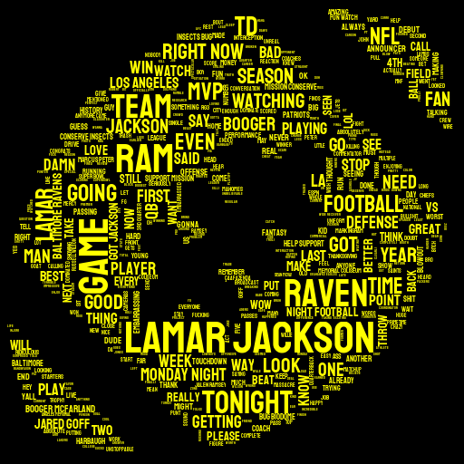

# twcloud


Generate a word cloud of [Twitter](https://twitter.com/) tweets with a single command.

twcloud is a Python package that leverages the [twint](https://github.com/twintproject/twint) package to gather Tweets from any public account without requiring authentication, and the [stylecloud](https://github.com/minimaxir/stylecloud) package which adds many useful features to create truly unique word clouds!

* Retrieve tweets from a user, or a Twitter search.
* Gather any number of Tweets from the specified query for building the word cloud (even beyond the typical 3,200 limit)
* Command Line Interface!

Additionally, from the base `stylecloud` package:

* Icon shapes (of any size!) for word clouds
* Support for advanced color palettes (via [palettable](https://jiffyclub.github.io/palettable/))
* Manual color selection for text and backgrounds,
* Directional gradients w/ the aforementioned palettes.

## Installation

You can install [twcloud](https://pypi.org/project/twcloud/) via pip:

```sh
pip3 install twcloud
```

## Usage

You can use twcloud in a Python script or as a standalone CLI app. For example, let's visualize Twitter CEO [Jack Dorsey](https://twitter.com/jack)'s most recent Tweets:

From Python:

```python
import twcloud

twcloud.gen_twcloud(username='jack')
```

Or from the command line:

```sh
twcloud --username jack
```


You can also search for keywords. How about finding English Tweets about `#MondayNightFootball`, and changing the theming appropriately?

```python
import twcloud

twcloud.gen_twcloud(search='#MondayNightFootball lang:en',
                    icon_name='fas fa-football-ball',
                    background_color='black',
                    colors='yellow')
```
```sh
twcloud --search '#MondayNightFootball lang:en' --icon_name 'fas fa-football-ball' --background_color black --colors yellow
```



A little known feature of Twitter search is that if you search for a Tweet URL, you will get all Quote Tweets corresponding to that tweet. How about getting English quote tweets resulting from the recent tweet [asking for quote tweets with controversial food opinions](https://twitter.com/jonbecker_/status/1196805486907052033)?

```python
import twcloud

twcloud.gen_twcloud(search='https://twitter.com/jonbecker_/status/1196805486907052033 lang:en',
                    icon_name='fas fa-utensils',
                    background_color='#c0392b',
                    palette='colorbrewer.sequential.YlOrBr_3',
                    gradient='vertical')
```

```sh
twcloud --search 'https://twitter.com/jonbecker_/status/1196805486907052033 lang:en' --icon_name 'fas fa-utensils' --background_color '#c0392b' --palette colorbrewer.sequential.YlOrBr_3 --gradient vertical
```


### Helpful Parameters

These parameters are valid for both the Python function and the CLI (you can use `twcloud -- --help` to get this information as well). Additional visual customization parameters can be found [within the stylecloud repo](https://github.com/minimaxir/stylecloud#helpful-parameters).

* username: Twitter @ username to gather tweets (excluding the @). Any public Twitter account is valid.
* search: Search query to use. Can use a hashtag or a tweet URL (to get quote-tweets)
* limit: Number of tweets to gather before rendering the twcloud [default: `500`]

#### stylecloud parameters w/ Changed Defaults

* icon_name: Icon Name for the stylecloud shape. (e.g. 'fas fa-grin') [default: `fab fa-twitter`]
* colors: Color(s) to use as the text colors. [default: `white`]
* background_color: Background color (name or hex) [default: `#1DA1F2`]
* output_name: Output file name of the stylecloud. [default: `twcloud.png`]

## Helpful Notes

* Specifying a `palette` parameter will override the `colors` parameter. This is the reverse of `stylecloud`.
* Saving the retrieved tweets is out of scope for this package. If you want to save the tweets + additional metadata, use `twint` directly.
* `username` queries will not return Retweets made by the user.
* Advanced search filters can be useful too for increasing the quality of the twcloud, e.g. `filter:verified` to retrieve only tweets from verified users, or `lang:en` to retrieve only English tweets.

## Maintainer/Creator

Max Woolf ([@minimaxir](https://minimaxir.com))

*Max's open-source projects are supported by his [Patreon](https://www.patreon.com/minimaxir) and [GitHub Sponsors](https://github.com/sponsors/minimaxir). If you found this project helpful, any monetary contributions to the Patreon are appreciated and will be put to good creative use.*

## License

MIT

## Disclaimer

This repo has no affiliation with Twitter Inc.